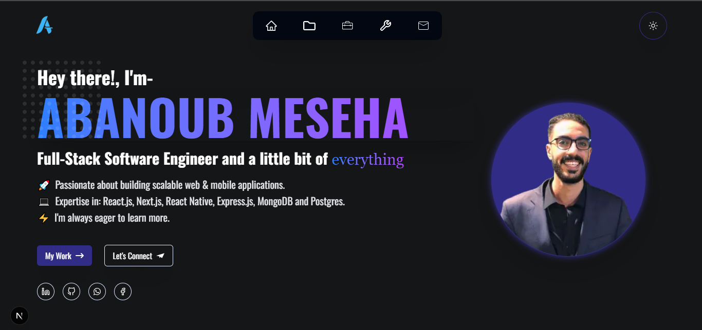

# 🚀 My Portfolio Website  

Welcome to my portfolio! This project showcases my skills, projects, and experience as a **Full-Stack Developer**.  

## 🔗 Live Demo  
[Click here to visit the live site](https://abanoub-portofolio-2025.vercel.app/)  

## 📂 Tech Stack  
- **Framework:** Next.js (App Router)  
- **Styling:** Tailwind CSS v4  
- **Animations:** AOS (Animate On Scroll)  
- **Backend:** Next.js API Routes  
- **Deployment:** Vercel  

## 📸 Screenshots  
<!-- Add screenshots here if available -->


## ⚙️ Features  
- Fully responsive design 🌍 
- Smooth scrolling and animations ✨  
- Dynamic content with API integration 🔗  
- SEO optimized 🚀  

## 🛠 Installation & Setup  
To run the project locally:  

```bash
git clone https://github.com/Abanoob-Meseha/Abanoub_portofolio_2025.git  
cd Abanoub_portofolio_2025  
npm install  # or yarn install  
npm run dev  # or yarn dev  
